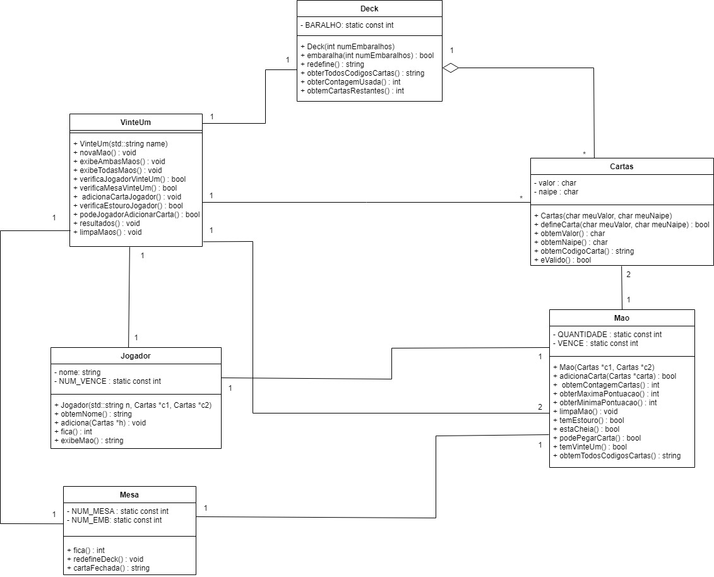
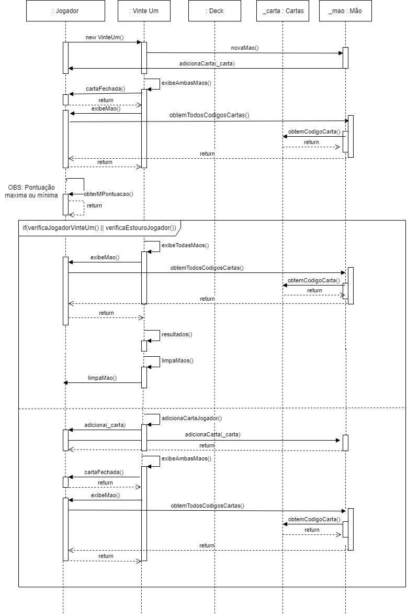

# Projeto Final Programação Orientado à Objetos - Jogo de cartas 21

## 1 - Regras do jogo
O objetivo deste jogo é fazer a soma mais próxima ou igual a 21, sem ultrapassar este valor.
Neste jogo, o jogador recebe duas cartas, que são chamas de "mao do jogador", as quais ficam viradas com seu valor a mostra. A mesa, o oponente do jogador, também recebe duas cartas, que são chamadas de "maõ da mesa", mas somente uma destas cartas tem seu valor à mostra, a carta que continua virada é comunmente chamada de “hole card”, ou então "carta fechada".

Apóso jogador e a mesa receberem suas cartas é feita a soma das cartas do jogador. A partir do valor de sua soma o jogador pode escolher correr o risco e virar mais uma carta para a soma ficar mais próxima de 21, ou então ficar com as que já tem, sem correr o risco de ultrapassar 21.

Depois da decisão do jogador o jogo pode ter os seguintes resultados:
* Se o jogador não tiver 21 e a mesa tiver, o jogador perde.
* Se o jogador tiver 21 e a mesa não, o resultado é "21", entao o jogador venceu.
* Se tanto o jogador quanto a mesa tiverem 21, é um empate.
* Se a mao da mesa e maior que a mao do jogador, e nenhum deles estourou o valor, o jogador perde.
* Se a mao do jogador e maior que a mao damesa, e nenhum deles estourou o valor, o jogador ganha.
* Se a mao da mesa estourou o jogador vence.
* Se a mao do jogador estoura ele perde.
* Se a pontuação do jogador e da mesa for igual, o jogo é um empate.

### Valor das cartas
* Cartas de 2 a 9: os valores correspondem às cartas;
* Cartas 10, valete, dama e rei: todas as cartas valem 10;
* Às: ela pode valer 1 ou 11, dependendo da mão.

## 2 - Caso de Uso: Jogar 21

Atores: Jogador

Descrição: O sistema dá ao jogador a opcão de começar o jogo ou sair. Quando o jogador escolhe começar o jogo o programa pergunta à ele seu nome e inicia o jogo. 

São dadas ao jogador duas cartas com seus valores a mostra. São dadas também duas cartas à mesa, uma com valor a mostra e outra com valor escondido. A partir das suas cartas o jogador escolhe se ele quer adicionar uma nova carta ao seu conjunto de cartas ou se ele quer ficar com as que já tem. 

Caso ele escolha adicionar, uma nova carta é adicionada à sua mão. Se já de primeira o jogador tenha a soma de 21 o sistema decide pelo jogador automaticamente que ele irá ficar com as cartas, para não passar o valor de 21. Enquanto o jogador nao tiver a soma de cartas igual a 21, o programa fica em loop perguntando se o jogador quer adicionar uma nova carta ou então ficar com as que tem. 

Caso a soma das cartas ultrapasse 21, ao adicionar uma carta, é dito que houve estouro, e o programa sai automaticamente deste loop.

Quando o jogador escolher ficar com as cartas, as cartas da mesa são exibidas em sua totalidade e com isso ambas as mãos vão para análise para ver o resultado do jogo.

Após a análise do resultado, ambas as mãos são limpas e há a opção para o jogador de iniciar um novo jogo ou sair do jogo.

## 3 - Análise e Projeto Orientado a Objetos

### Diagrama de Classes

### Diagrama de Sequência

Para abrir os diagramas: https://app.diagrams.net/

